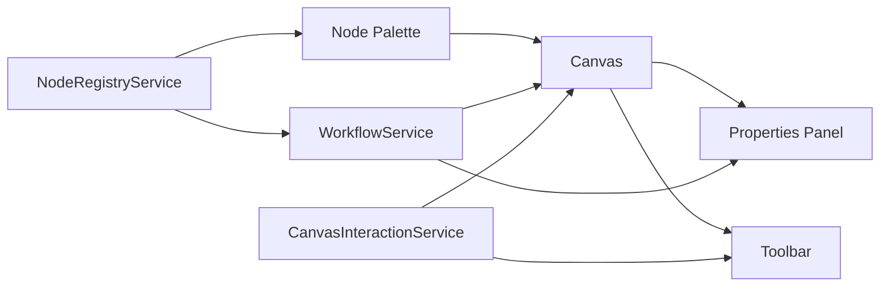

I recently built a visual workflow designer — a node-based canvas where you wire together processing steps to compose data pipelines. It's the kind of tool you see in platforms like Node-RED, Apache NiFi, or n8n, but built from scratch with Angular 19 and a handful of well-chosen libraries. You can [try it live here](https://briankeating.net/flow-design-canvas/).

In this post I'll walk through the architectural decisions, the Angular 19 features that made it enjoyable to build, and the patterns I'd use again.


## The Problem Space

Workflow designers need to solve several interrelated problems at once: rendering an interactive canvas with pan and zoom, managing a graph of connected nodes, keeping node configuration in sync with the visual state, and doing all of it with an experience that feels immediate. The challenge isn't any single piece — it's holding them all together cleanly.

## Technology Choices

### ngx-vflow for the Canvas

The biggest decision was how to handle the canvas. Building a custom pan-zoom-drag-connect canvas from scratch is weeks of work and a maintenance burden. I chose [ngx-vflow](https://www.ngx-vflow.com/), a purpose-built Angular library for flow diagrams. It handles:

- Node rendering with custom HTML templates
- Edge drawing with bezier curves
- Pan, zoom, and minimap
- Snap-to-grid
- Connection validation

This let me focus on the domain — the workflow nodes, their configuration, and how they relate — rather than fighting with pointer events and SVG paths.

### Angular Material for Forms

Each node type needs its own configuration form (URL and auth settings for HTTP requests, prompt and model for AI assistants, table and batch size for database loads). Angular Material's form field components gave me a consistent dark-theme UI with minimal effort. Combined with Reactive Forms, the property editing experience came together quickly.

### Signals over NgRx

This was the most deliberate choice. Traditional Angular state management with NgRx or similar libraries would have added boilerplate for what is fundamentally a simple data flow: a list of nodes, a list of edges, and which node is selected. Angular 19's signals handle this perfectly.

## Architecture Overview

The application follows a three-column layout — node palette on the left, canvas in the centre, and a properties panel on the right that appears when a node is selected.



Three services manage the state:

- **WorkflowService** — owns the nodes and edges as signals, handles selection
- **NodeRegistryService** — a factory and registry for the seven node types
- **CanvasInteractionService** — UI state like zoom level, snap-to-grid toggle, and minimap visibility

## Signal-Based State Management

The core of the application is `WorkflowService`, and it's remarkably small — about 80 lines. The state is three signals and a computed value:

```typescript
@Injectable({ providedIn: 'root' })
export class WorkflowService {
  readonly nodes = signal<WorkflowNode[]>([]);
  readonly edges = signal<WorkflowEdge[]>([]);
  readonly selectedNodeId = signal<string | null>(null);

  readonly selectedNode = computed(() => {
    const id = this.selectedNodeId();
    return this.nodes().find((n) => n.id === id) ?? null;
  });
}
```

Updates are immutable — `nodes.update(ns => [...ns, newNode])` — which keeps change detection predictable and debugging straightforward. The `selectedNode` computed signal means the properties panel reactively shows the right form without any subscription management.

## The Node Type System

I wanted adding a new node type to be a matter of defining three things: a registration entry (icon, label, category, default properties), a TypeScript interface for its properties, and a form component. The type system enforces this with a discriminated union:

```typescript
type NodeProperties =
  | HttpRequestProperties
  | FtpDownloadProperties
  | ExcelMapperProperties
  | PdfMapperProperties
  | TransformerProperties
  | AiAssistantProperties
  | DbLoadProperties;
```

The `NodeRegistryService` maps each `NodeType` enum value to its metadata and acts as a factory for creating node instances with unique IDs, default properties, and port definitions.

Seven node types ship today across three categories:

| Category | Nodes |
|---|---|
| **Input** | HTTP Request, FTP Download |
| **Processor** | Excel Mapper, PDF Mapper, Transformer, AI Assistant |
| **Output** | Database Load |

## Bridging Signals and ngx-vflow

The trickiest piece was the `CanvasShellComponent`. ngx-vflow manages its own internal state with signals — each node has position, data, and selection signals. My `WorkflowService` also uses signals. Keeping these two signal worlds in sync required a reconciliation strategy.

I maintain a `Map<string, VflowNodeEntry>` that caches the per-node signals ngx-vflow needs. An `effect()` watches the domain nodes and reconciles:

```typescript
private readonly reconcileEffect = effect(() => {
  const domainNodes = this.workflowService.nodes();
  // For each domain node:
  //   - If new: create vflow signals and add to map
  //   - If existing: update the signals in place
  //   - If removed: delete from map
  // Then rebuild the vflowNodes signal array
});
```

This avoids recreating signals every cycle, which would break ngx-vflow's internal change tracking. It's a pattern I'd reach for any time you need to bridge two signal-based systems.

## Dynamic Properties Panel

When you select a node, the properties panel renders the correct form using Angular 19's `@switch` control flow:

```typescript
@switch (node.data.nodeType) {
  @case (NodeType.HttpRequest) {
    <app-http-request-form
      [properties]="$any(node.data.properties)"
      (propertiesChange)="onPropertiesChange($event)" />
  }
  @case (NodeType.AiAssistant) {
    <app-ai-assistant-form
      [properties]="$any(node.data.properties)"
      (propertiesChange)="onPropertiesChange($event)" />
  }
  // ... five more cases
}
```

Each form component follows the same contract: a `properties` input, a `propertiesChange` output, and internally a reactive form with 300ms debouncing to avoid flooding the workflow service with updates on every keystroke.


## Angular 19 Features Worth Highlighting

A few Angular 19 features made this project noticeably smoother than it would have been even a year ago:

**Standalone components everywhere.** No `NgModule` declarations, no shared modules. Every component imports exactly what it needs. The mental overhead of module boundaries is just gone.

**Built-in control flow.** `@if`, `@for`, and `@switch` replace structural directives. They're faster (better tree-shaking), and the template reads more naturally — especially the `@switch` block for the properties panel.

**Signals and computed values.** The entire state layer is signals. No `BehaviorSubject`, no `async` pipe, no subscription cleanup. The `computed()` for derived state and `effect()` for side effects cover everything I needed.

**Event coalescing.** A single line in the app config — `provideZoneChangeDetection({ eventCoalescing: true })` — batches change detection for canvas interactions where many events fire in rapid succession.

## Theming with CSS Custom Properties

The dark theme uses CSS custom properties for every colour, with each node type getting its own accent:

```scss
:root {
  --node-color-http-request: #00a8ff;
  --node-color-ftp-download: #ff7d00;
  --node-color-excel-mapper: #39b84a;
  --node-color-pdf-mapper: rgb(251, 75, 75);
  --node-color-transformer: #d986ff;
  --node-color-ai-assistant: #f5b800;
  --node-color-db-load: #26c6da;
}
```

Each node renders a coloured stripe on the left edge using its accent colour. It's a small touch, but it makes the canvas scannable at a glance — you can immediately tell your inputs from your processors from your outputs.

## What I'd Do Differently

**Drag-from-palette.** Currently, clicking a node in the palette adds it to the canvas at an auto-calculated position. True drag-and-drop from the palette to the canvas would feel more natural. ngx-vflow supports this; I just haven't wired it up yet.

**Undo/redo.** With immutable signal updates, implementing undo is straightforward — snapshot the signals on each mutation and replay. It's the next feature I'd add.

**Persisting workflows.** The node and edge arrays serialise cleanly to JSON. Adding localStorage or a backend save endpoint would make this actually useful beyond a demo.

## Try It

The app is deployed to GitHub Pages and the source is on GitHub:

- **Live demo:** [briankeating.net/flow-design-canvas](https://briankeating.net/flow-design-canvas/)
- **Source:** [github.com/brianbruff/flow-design-canvas](https://github.com/brianbruff/flow-design-canvas)

It's a single `ng build` with no server requirements. If you're exploring Angular 19's signal-based patterns or looking for a starting point for a visual editor, take a look.
